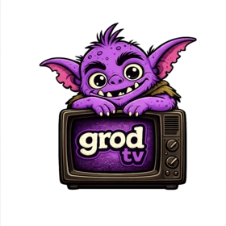

<div align="center">



# grod_tv

**Android TV companion to [grod](https://github.com/captainzonks/grod) — runs the queue, the Piped resolver, and the player on the TV itself.**

[](https://kotlinlang.org/)
[](https://developer.android.com/tv)
[](https://developer.android.com/jetpack/androidx/releases/media3)
[](LICENSE)

> Single APK Android TV remote: queue persistence, Piped stream resolution, hardware-decoded 1080p playback via Media3's `MergingMediaSource`, drop-in HTTP API + mDNS — no laptop, no ffmpeg, no Chromecast protocol.

</div>

---

## Overview

`grod_tv` is a Kotlin + Jetpack Compose for TV app that replaces the laptop-hosted `grod` daemon for users with an Android TV device (Nvidia Shield TV, Chromecast with Google TV, Fire TV Stick, Sony/Hisense Google TVs, etc.). The TV becomes the queue manager, Piped resolver, and media player; the existing [`grod_remote`](https://github.com/captainzonks/grod) Flutter phone app drives it unchanged over the same LAN HTTP API and mDNS surface as the Rust daemon.

### Why grod_tv?

- **One device.** No laptop awake on the LAN, no lid-close suspending playback, no Chromecast media-receiver quirks.
- **No transcoding.** Media3's `MergingMediaSource` merges Piped's separate video-only + audio-only streams directly in the decoder — what the Rust daemon does with libx264 + HLS, Android does with the hardware video decoder.
- **Wire-compatible.** Same HTTP routes, same JSON, same `_grod._tcp.local.` mDNS service as the Rust daemon — `grod_remote` doesn't notice the difference.
- **Privacy-preserving.** Ad-free YouTube via a self-hosted [Piped](https://github.com/TeamPiped/Piped) instance. No Google services dependency at runtime.

---

## Key Features

### Playback

- Compose for TV foreground UI, Media3 ExoPlayer 1.5.1 backend
- `MergingMediaSource(videoOnly, audioOnly)` plays Piped's separate 1080p H.264 + 126 kbps AAC tracks without remuxing
- Configurable quality preference: `best | 1080p | 720p | 480p | 360p`
- Automatic fallback to muxed mp4 (~360p) when a target quality is unavailable
- Original-audio-track preference (skips auto-dubs on multi-language videos)
- `MediaSessionService` foreground service — playback survives backgrounding and shows now-playing in Android TV system UI

### Queue & State

- Room-backed persistent queue at `/data/data/com.captainzonks.grodtv/databases/grod_tv.db`
- Auto-advance: `MergingMediaSource` ends → pop head → resolve → load, repeat
- Singleton now-playing row separate from queue rows (mirrors `grod` daemon semantics)
- 1-based positions over the wire, 0-based internally (matches the Rust DTOs)

### LAN HTTP API + Discovery

- Ktor CIO server on configurable port (default `7878`)
- Optional `X-Grod-Pin` header authentication
- Endpoints byte-compatible with the Rust daemon: `/status`, `/cast`, `/queue`, `/quality`, `/play-pause`, `/skip`, `/forward`, `/back`, `/volume-up`, `/volume-down`, `/mute`, `/unmute`, `/search`
- mDNS service advertisement via `NsdManager` (`_grod._tcp.local.`) with TXT records `version`, `pin`, `device=grod-tv` — the Rust daemon advertises `device=laptop` on the same service so remotes can disambiguate

### TV UI

- First-run screen displays each non-loopback IPv4 + port `7878` so you know what to type into `grod_remote`
- Home screen is a full-bleed `PlayerView` with a D-pad-UP overlay for now-playing + queue
- Settings screen: Piped API URL, default quality (`DropdownMenu`), API PIN, "Test connection" probe

See [`docs/api.md`](docs/api.md) for the full wire protocol.

---

## Architecture

```text
┌──────────────────────────────────────────────────────────────────┐
│ Android TV device                                                │
│                                                                  │
│  ┌────────────────────────┐    ┌─────────────────────────────┐   │
│  │ Ktor HTTP API (7878)   │    │ PlayerController            │   │
│  │  - same routes as Rust │    │  - ExoPlayer (Media3)       │   │
│  │    grod daemon         │    │  - MergingMediaSource for   │   │
│  │  - X-Grod-Pin auth     │    │    video-only + audio-only  │   │
│  │  - hosted by Lifecycle │    │  - OkHttpDataSource for     │   │
│  │    foreground service  │    │    Cloudflare-fronted CDN   │   │
│  └──────────┬─────────────┘    └────────────┬────────────────┘   │
│             │                               │                    │
│  ┌──────────▼───────────────────────────────▼──┐                 │
│  │ AppContainer  (manual DI singleton)         │                 │
│  │  - SettingsStore (DataStore Preferences)    │                 │
│  │  - QueueRepository (Room)                   │                 │
│  │  - PipedClient (OkHttp + kotlinx.json)      │                 │
│  │  - AutoAdvancer (pure state-machine)        │                 │
│  └──────────┬──────────────────────────────────┘                 │
│             │                                                    │
│             ▼                                                    │
│  ┌────────────────────────┐    ┌─────────────────────────────┐   │
│  │ NsdManager mDNS        │    │ Compose for TV UI           │   │
│  │  - _grod._tcp.local.   │    │  - Nav: Home/Settings/      │   │
│  │  - device=grod-tv TXT  │    │           FirstRun          │   │
│  │  - MulticastLock       │    │  - PlayerView via AndroidView│  │
│  └────────────────────────┘    └─────────────────────────────┘   │
└──────────────────────────────────────────────────────────────────┘
              ▲
              │ HTTP (+ optional X-Grod-Pin)
              │ mDNS PTR/SRV/TXT
              │
┌──────────────────────────────────────────────────────────────────┐
│ Flutter phone app (grod_remote, unchanged)                       │
└──────────────────────────────────────────────────────────────────┘
```

The TV resolves stream URLs from Piped, picks the best video-only + audio-only stream pair for the configured quality, hands both to Media3's `MergingMediaSource`, and lets the platform decoder do the rest. There is no muxer, no transcode, no local HTTP relay.

See [`docs/design.md`](docs/design.md) for the long-form architecture rationale, and [`docs/architecture.md`](docs/architecture.md) for the module map.

---

## Dependencies

- **A self-hosted [Piped](https://github.com/TeamPiped/Piped) instance** — `grod_tv` does not embed a YouTube resolver.
- **Android TV 9+ (API 28+)** — `minSdk = 28`, tested on Nvidia Shield TV and Android TV API 36 x86_64 emulator.
- **No Google services dependency at runtime** — works on AOSP-flavored TVs.

Build-time dependencies (handled by Gradle): AGP 8.10.0, Kotlin 2.0.21, JDK 17, Media3 1.5.1, Compose BOM 2024.12.01, Ktor 2.3.13, Room 2.6.1, DataStore 1.1.1, OkHttp 4.12.0. Full list in [`gradle/libs.versions.toml`](gradle/libs.versions.toml).

---

## Installation

### Sideload (recommended, until F-Droid / Play Store listing)

1. Download `app-debug.apk` (or `app-release.apk`) from the [GitHub releases](https://github.com/captainzonks/grod_tv/releases) page.
2. On the TV: **Settings → Apps → Security → Unknown sources** → enable for your file manager or `adb`.
3. Transfer the APK and install:
   ```bash
   adb connect <tv-ip>:5555         # if not already paired
   adb install -r app-debug.apk
   ```

### From source

```bash
git clone https://github.com/captainzonks/grod_tv
cd grod_tv
./gradlew :app:assembleDebug
adb install -r app/build/outputs/apk/debug/app-debug.apk
```

See [`docs/build.md`](docs/build.md) for full toolchain setup (JDK, Android SDK, emulator config) and [`docs/emulator.md`](docs/emulator.md) for the Android TV emulator gotchas hit during development.

---

## Quick Start

```text
1. Launch grod_tv on the TV.
2. The first-run screen shows the TV's LAN IP and port (e.g. 192.168.1.42:7878).
3. Press OK.
4. On the phone, open grod_remote → it discovers the TV via mDNS as `_grod._tcp.local.` (device=grod-tv).
5. Cast a video. Playback starts on the TV.
```

To cast without the phone app:

```bash
curl -X POST http://<tv-lan-ip>:7878/cast \
     -H 'Content-Type: application/json' \
     -d '{"url":"https://www.youtube.com/watch?v=dQw4w9WgXcQ"}'
```

If the device is busy, the video is queued instead of replacing the current track. Pass `"force": true` to interrupt.

---

## Configuration

All settings live in DataStore Preferences and are edited from the in-app **Settings** screen (open via the D-pad-UP overlay on the Home screen → Settings).

| Setting              | Default                            | Notes                                          |
| -------------------- | ---------------------------------- | ---------------------------------------------- |
| Piped API URL        | `https://pipedapi.kavin.rocks`        | Override with your own instance                |
| Default quality      | `1080p`                            | `best \| 1080p \| 720p \| 480p \| 360p`        |
| API PIN              | empty (open access)                | Sent in `X-Grod-Pin` header when set           |
| First-run seen       | `false`                            | Flipped to `true` after dismissing first-run   |

The Settings screen has a **Test connection** button that probes the typed URL with a real `search?q=test` call and reports OK + result count, or the error message inline.

See [`docs/settings.md`](docs/settings.md) for a full reference.

---

## Usage

### Cast a video

```bash
curl -X POST http://<tv-ip>:7878/cast \
     -H 'Content-Type: application/json' \
     -d '{"url":"https://www.youtube.com/watch?v=dQw4w9WgXcQ"}'
```

Accepts YouTube URLs, Piped URLs, `youtu.be/<id>` shortlinks, and bare 11-char video IDs.

### Queue management

```bash
curl -X POST   http://<tv-ip>:7878/queue       -d '{"url":"..."}'   # append
curl -sS       http://<tv-ip>:7878/status                            # now-playing + queue
curl -X DELETE http://<tv-ip>:7878/queue/1                           # remove 1-based pos
curl -X DELETE http://<tv-ip>:7878/queue                             # clear all
```

### Playback controls

```bash
curl -X POST http://<tv-ip>:7878/play-pause
curl -X POST http://<tv-ip>:7878/skip
curl -X POST http://<tv-ip>:7878/forward     -d '{"seconds":10}'
curl -X POST http://<tv-ip>:7878/back        -d '{"seconds":10}'
curl -X POST http://<tv-ip>:7878/volume-up
curl -X POST http://<tv-ip>:7878/volume-down
curl -X POST http://<tv-ip>:7878/mute
curl -X POST http://<tv-ip>:7878/unmute
```

### Search

```bash
curl -sS "http://<tv-ip>:7878/search?q=rick+astley"
```

### PIN authentication

If a PIN is set in Settings, every authenticated request must carry it:

```bash
curl -X POST http://<tv-ip>:7878/cast \
     -H 'X-Grod-Pin: 1234' \
     -H 'Content-Type: application/json' \
     -d '{"url":"https://www.youtube.com/watch?v=..."}'
```

Full endpoint reference in [`docs/api.md`](docs/api.md).

---

## D-pad Controls (Home screen)

| Key                | Action                                       |
| ------------------ | -------------------------------------------- |
| `Up`               | Toggle the now-playing / queue overlay on    |
| `Back` / `Escape`  | Dismiss the overlay                          |
| `OK` (center)      | Activate focused button                      |

PlayerView's own controls (play/pause, seek bar) take over when the player has focus; press any D-pad key on the player surface to surface them.

---

## Development

```bash
# Build + install debug on attached device/emulator
./gradlew :app:assembleDebug
adb install -r app/build/outputs/apk/debug/app-debug.apk

# Run JVM unit tests (PipedClient, AutoAdvancer, etc.)
./gradlew :app:testDebugUnitTest

# Run instrumentation tests against a running emulator/device (QueueDao, etc.)
./gradlew :app:connectedDebugAndroidTest
```

The Android TV emulator setup used during development is described in [`docs/emulator.md`](docs/emulator.md) — including the Wayland audio routing fix, the `-dns-server` flag required on API 36 TV images, and the AVD path workaround for `_JAVA_OPTIONS` userRoot redirects.

The full module layout, DI strategy, and the key gotchas (`OkHttpDataSource` for Cloudflare-fronted googlevideo; ExoPlayer mutators must run on `Dispatchers.Main`) are documented in [`docs/architecture.md`](docs/architecture.md).

---

## Companion Repos

- [`grod`](https://github.com/captainzonks/grod) — Rust CLI + laptop daemon. Still recommended for users without a smart TV. Advertises `device=laptop` on the same `_grod._tcp.local.` mDNS service.
- `grod_remote` — Flutter phone remote app. Discovers either daemon via mDNS and drives them over the same HTTP API.

---

## Roadmap

- F-Droid metadata + release-signed APKs in GitHub releases (Phase 5)
- Leanback Browse fragment polish — TvLazyColumn with focus stealing on overlay open (today's overlay swallows D-pad UP even when buttons are focused)
- Surface `PlaybackPhase.Error` in `/status` instead of mapping to `idle` when the player has a source error
- Backend-degradation handling for Piped: retry once, surface error toast in the now-playing UI
- Sponsorblock segment skipping (Piped already returns the data)
- Per-device quality profiles (Shield 1080p, Fire TV Stick 720p, etc.)

---

## Acknowledgments

- **[Piped](https://github.com/TeamPiped/Piped)** — for delivering ad-free YouTube playback that this entire project is built around.
- **[Media3](https://developer.android.com/jetpack/androidx/releases/media3) / ExoPlayer** — for `MergingMediaSource` rendering the laptop's ffmpeg HLS pipeline obsolete on Android.
- **[Ktor](https://ktor.io/)** + **[Room](https://developer.android.com/jetpack/androidx/releases/room)** + **[DataStore](https://developer.android.com/jetpack/androidx/releases/datastore)** + **[OkHttp](https://square.github.io/okhttp/)** — the Kotlin + Android plumbing that makes the whole thing tick.

---

## License

[MIT](LICENSE) © captainzonks
